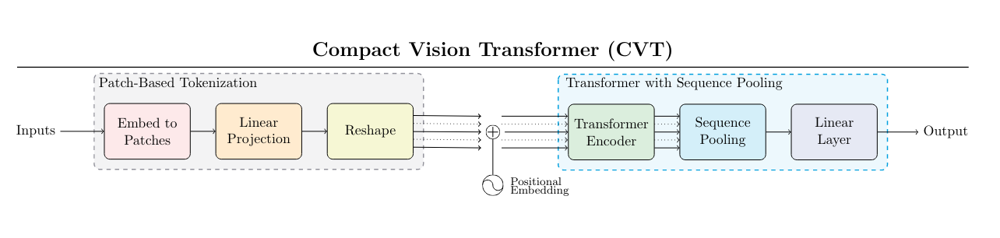

# SeqPool
Pytorch library implementing pooling methods for sequences of embedding vectors.

## Installation

```
pip install seqpool
```
..or build from source ～

## Usage

Import a sequence pooling layer and apply it to a `(batch, length, embedding)` shaped tensor:
```python
from seqpool import CVTSeqPool

f = CVTSeqPool(128)
x = torch.randn(4, 1024, 128) # for example, take x from a transformer's output
y = f(x) # (4, 1024, 128) -> (4, 128)
```

Typical use-case is in the training of a smaller model using a pretrained
model's embeddings, for example a BERT-style model.

## Variants

**Escaping the Big Data Paradigm with Compact Transformers** [arXiv](https://arxiv.org/abs/2104.05704)



```python
from seqpool import CVTSeqPool
f = CVTSeqPool(in_dim=128)
```

This paper proposes a number of improvements on Vision Transformers to improve
performance on low-data tasks. One improvement was a "SeqPool" mechanism.
A single linear layer produces a weighting for each sequence element, then
softmax is applied. This is then used to compute the weighted sum of all
embedding vectors. The intuition is that each sequence element does not contain
the same amount of entropy, and so allowing the model to construct its own
weighting on importance helps improve performance on the downstream task.

---

### References

**Escaping the Big Data Paradigm with Compact Transformers**
> Ali Hassani, Steven Walton, Nikhil Shah, Abulikemu Abuduweili, Jiachen Li, Humphrey Shi
```
@article{hassani2021escaping,
  title={Escaping the big data paradigm with compact transformers},
  author={Hassani, Ali and Walton, Steven and Shah, Nikhil and Abuduweili, Abulikemu and Li, Jiachen and Shi, Humphrey},
  journal={arXiv preprint arXiv:2104.05704},
  year={2021}
}
```
